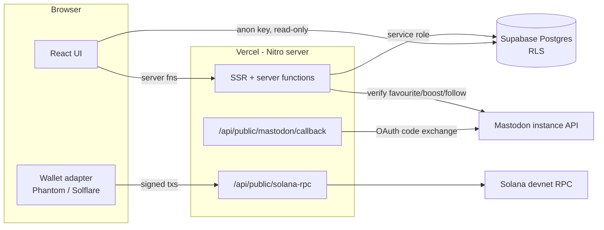

# ChainDraw — Architecture

Full-stack TypeScript app: **TanStack Start (React 19, SSR) + Supabase (Postgres) + Solana (devnet)**, deployed on **Vercel** at https://luckydraw.y09.space. Originally scaffolded with Lovable (which keeps a Cloudflare Workers build target working in its sandbox); production runs on Vercel via Nitro's `vercel` preset.

## Stack at a glance

| Layer | Technology |
|---|---|
| Framework | TanStack Start 1.x (file-based routing, server functions, SSR) on Vite 8 |
| UI | React 19, Tailwind CSS 4, shadcn/ui (Radix), sonner, lucide |
| Server runtime | Nitro 3 (preset auto-detected: `vercel` on Vercel, `cloudflare-module` in Lovable sandbox) |
| Database | Supabase Postgres with RLS (user-owned project `qukokfeirmmhcrwquaxi`, migrated off Lovable Cloud 2026-08-22) |
| Blockchain | Solana devnet via `@solana/web3.js` + wallet-adapter (Phantom, Solflare) |
| Social identity | Mastodon OAuth (dynamic per-instance app registration) |
| Package manager | Bun (`bun.lock`) |
| Hosting | Vercel (project `trustless-draw-solana`), Speed Insights enabled |
| DNS | Cloudflare (`luckydraw.y09.space` → CNAME `cname.vercel-dns.com`) |

## System diagram



## Repository layout

```
src/
  routes/                    # file-based routes
    __root.tsx               # HTML shell, providers, SpeedInsights, error boundaries
    index.tsx                # public event listing
    event.$id.tsx            # event detail + entry flow
    organizer.tsx/.index/.$id# organizer dashboard (create, manage, draw, pay)
    api/public/
      solana-rpc.ts          # POST proxy → SOLANA_RPC (keeps provider key server-side)
      mastodon/callback.ts   # OAuth redirect handler
  lib/
    events.functions.ts      # server fns: listEvents, getEvent, listOrganizerEvents
    organizer.functions.ts   # server fns: createEvent, commitPool, drawAndPay, recordPayout
    join.functions.ts        # server fn: joinEvent (session + engagement checks)
    mastodon-auth.*          # OAuth start/session/signout + signed-cookie session
    mastodon.server.ts       # Mastodon API client (favourites, boosts, follows)
    wallet-auth.server.ts    # ed25519 challenge-signature verification (organizer auth)
    solana.ts                # browser-side: commit/payout memo txs via RPC proxy
  components/                # app + shadcn/ui components (wallet, panels, forms)
  integrations/supabase/
    client.ts                # browser client (VITE_ publishable key, RLS enforced)
    client.server.ts         # admin client (SERVICE_ROLE_KEY, bypasses RLS)
supabase/migrations/         # schema (5 migrations)
vite.config.ts               # Lovable config + Solana SSR shims (see below)
```

## Data model (Postgres)

- **events** — one row per giveaway: `organizer_pubkey`, Mastodon post refs (`mastodon_instance`, `mastodon_status_id`, `mastodon_account_acct`), requirement flags (`require_favourite/boost/follow`), prize (`prize_token`, `prize_total`, `num_winners`), `cutoff_ts`, lifecycle `status` (`draft → open → settled`), on-chain refs (`commit_tx`, `draw_seed`, `delegation_pda` reserved for future escrow). Publicly readable (RLS).
- **entries** — verified entrants: `handle`, `handle_hash` (SHA-256, unique per event to block duplicates), `wallet`, sequential `index` used by the draw. Publicly readable.
- **winners** — draw results: `entry_id`, `share` (prize_total / num_winners), `payout_tx` filled in after payment. Publicly readable.
- **verification_log** — per-attempt audit trail of Mastodon checks. Service-role only (was public, locked down in migration 2).
- **mastodon_oauth_apps** — per-instance OAuth client credentials, registered dynamically. Service-role only, explicit deny-all policy for clients.

Write access in practice goes exclusively through server functions using the service-role client; the browser's anon client is read-only display data.

## Key flows

### Organizer: create → commit → draw → pay
1. **createEvent** validates the Mastodon post URL, resolves the status via the instance API, stores the event as `draft`.
2. **Commit**: browser builds a Memo-program devnet tx (`chaindraw:commit:<id>:<amount>:<token>` + dust self-transfer), the organizer's wallet signs it, and `commitPool` stores the signature and flips status to `open`.
3. **drawAndPay** (server): loads entries, generates a 32-byte random seed, runs a deterministic LCG-based Fisher-Yates shuffle keyed on that seed, inserts `winners` rows with equal shares, stores `draw_seed` (hex) and sets status `settled`. Publishing the seed makes the shuffle reproducible by anyone.
4. **Payout**: browser sends a payout memo tx per winner; `recordPayout` stores the tx signature on the winner row.

Privileged calls (`commitPool`, `drawAndPay`, `recordPayout`) require **wallet-signature auth**: the client signs the challenge `chaindraw:<action>:<eventId>:<issuedAt>` with the organizer's key; the server verifies the ed25519 signature against `organizer_pubkey` and rejects timestamps older than 5 minutes. Knowing the (public) organizer pubkey is not enough — you must control the key.

### Entrant: sign in → verify → enter
1. **startMastodonLogin** registers (or reuses) an OAuth app on the entrant's instance and redirects to authorize; the callback exchanges the code and sets a **signed session cookie** (handle + instance). Identity is never taken from client input.
2. **joinEvent** checks: valid session, matching instance, event `open` and before cutoff, no duplicate `handle_hash` — then queries the Mastodon API for each required interaction (favourite / boost / follow) and logs the outcome to `verification_log`.
3. On success the entry is stored with the entrant's Solana wallet address for payout.

## Planned on-chain program (Anchor) — designed, not yet built

Designed 2026-08-22 during the Superteam MY "AI x Blockchain Builder Bootcamp" workshop assessment. **Nothing below is implemented**: no Anchor program written, no program ID, nothing deployed. It supersedes the *Key flows* section above (Memo-transaction commitment, Postgres-only entries, server-generated seed) once built — that flow stays the live MVP until this lands.

### Why the current commit/draw model needs to change

The Memo-based "commitment" is a public marker, not escrowed funds, and the draw seed is server-generated. Both are honest about what they are, but neither is trustless in the sense the product name promises. The design below closes that gap.

### Accounts

**Campaign PDA** — seeds `["campaign", creator_pubkey, campaign_id]`. Program-controlled, no private key exists for it — a plain generated wallet was considered and rejected: it would need the backend to hold a private key, which recreates exactly the custodial-trust problem the product exists to remove. The PDA address is derivable and public from the moment the campaign is created, so its balance (the actual committed prize) is checkable by anyone before a single entry exists. Stores: creator/authority, prize mint + amount, the vault (the PDA itself for SOL, or a token account owned by the PDA for SPL), an ending-trigger mode — either `end_time` (time-based) or `target_entry_count` (response-based: closes the moment that many valid entries exist) — `entry_count`, `num_winners`, a state enum (`open` / `drawing` / `completed` / `cancelled`), the winner once drawn, the randomness source used, and the bump.

**Entry PDA** — seeds `["entry", campaign_pubkey, participant_pubkey]`. The deterministic seeding *is* the duplicate-entry guard: a second join from the same wallet tries to create an account that already exists and the instruction's `init` constraint fails outright — enforced by the chain itself, not backend logic (a stronger answer than the current Postgres `UNIQUE(event_id, handle_hash)` constraint). Stores: participant pubkey, campaign, a sequential `entry_index` assigned at join time, timestamp, a **hash** of the off-chain platform-verification result (never the raw social data — privacy and rent cost), and the bump.

`entry_index` exists so the draw doesn't need to iterate every entry account on-chain (wouldn't fit in one transaction at scale): the draw picks a random number in `[0, entry_count)` and the winner is whichever entry holds that index.

### `join_campaign` instruction

Two signers:
- **Backend verifier wallet** — attests the off-chain platform-action check (Mastodon/Farcaster/etc.) passed. The campaign account stores the authorized `verifier` pubkey; the instruction rejects any signer that doesn't match, otherwise anyone could forge entries.
- **Participant** — signs to prove consent to enter with that specific wallet, since the prize auto-transfers there later. This does *not* break the gasless design: fee payer and signer are separate roles in a Solana transaction — the backend remains the fee payer (≈0.002 SOL rent for the new entry PDA), the participant only approves. This is a deliberate improvement over an earlier draft of the design that had the participant sign only an off-chain message: that leaves no on-chain record the participant ever agreed, so the entry rests entirely on the backend's word.

State changes: creates the entry PDA (rent funded by the backend; the `init` constraint blocks duplicates with no extra logic needed); increments `campaign.entry_count` by one. **No authority over the prize vault at all** — that separation is intentional, so a bug in the join path can't reach prize funds. Guards: `campaign.state == open`, ending trigger not yet met (clock before `end_time` for time-based campaigns, or `entry_count < target_entry_count` for response-based ones), signer must equal `campaign.verifier`.

For a response-based campaign, the `entry_count < target_entry_count` guard is itself the cutoff — the entry that fills the last slot succeeds, and the next attempt fails the guard outright. No separate "close" transaction is needed, and no organizer discretion is involved in when the campaign actually stops.

**Honest limitation:** entry admission still depends on the backend verifier key being honest. `draw_winner` and payout are designed to be fully permissionless, but a dishonest backend could sign entries for wallets that never completed the required action. Storing the verification hash on-chain makes that auditable after the fact — it does not prevent it at entry time. This is a real, currently-unsolved trust gap in the design, not a solved problem being glossed over.

### `draw_winner` instruction

Deliberately **not** backend-signed — designed as a permissionless "crank" callable by anyone once the campaign's ending trigger is met (`end_time` passed, or `entry_count == target_entry_count`), unlike `join_campaign`. Randomness source is leaning toward a VRF (Switchboard or ORAO) rather than a recent slot hash: slot hashes are influenceable by validators, which would undermine the one claim the whole product rests on.

### Lottery-ticket UX states

- **Pending** — after platform verification passes but before on-chain confirmation: "issuing your ticket," join button disabled to block double-submit. Deliberately never says "you're in" at this point — the transaction is submitted but not confirmed, and telling someone they have a ticket before it exists is exactly the trust problem being solved.
- **Success** — only after `confirmed` commitment: "you're in the draw," plus the tx signature rendered as an explorer link so the participant can verify the ticket themselves instead of trusting the UI.
- **Failure**, split by whose problem it is: a platform-action-not-detected failure is the participant's (tell them which task failed); a mint/RPC failure (blockhash expired, verifier wallet out of SOL) is the app's — offer retry, and the entry isn't consumed.
- The genuinely ambiguous case: confirmation times out but the transaction may have landed anyway. A naive retry there could mint two tickets to one wallet, quietly skewing draw odds. The entry PDA's `init` constraint is what actually forecloses this: a retry that tries to create the same `["entry", campaign, participant]` PDA again simply fails if it already exists, so double-minting is structurally impossible rather than something the client has to check for.

### Verification plan (the actual definition of "done" for this milestone)

In order of how convincing each is:

1. **Program ID from `anchor deploy` on devnet** — weakest; proves the code exists, nothing about fairness.
2. **Anchor test suite, weighted toward negative tests** — for a trust product, proving the thing *can't* be abused matters more than the happy path: joining twice from the same wallet must fail (`init` constraint); joining after `end_time` (time-based) or once `entry_count == target_entry_count` (response-based) must fail; `join_campaign` signed by a non-verifier key must fail; drawing before the ending trigger is met must fail; drawing twice must fail. Alongside these, balance assertions rather than bare "no error": vault lamports before/after payout, winner's balance increased by exactly the prize amount, vault left at rent-exempt minimum — plus state read-back (`entry_count` matches actual joins, an entry's `entry_index` is correct).
3. **A full, replayable devnet campaign** — the actual target proof, worth more than either of the above or UI polish: publish the program ID, the campaign PDA, and every transaction signature (create, each join, draw, payout). Anyone can then take the on-chain randomness value, compute it modulo `entry_count` themselves, and check it matches the winning `entry_index` independently. A passing test suite only proves the code does what the team says it does; a replayable campaign proves the claim to someone who doesn't trust the team at all — which is the whole point.

## The Solana/SSR problem (why vite.config.ts is unusual)

The Solana wallet stack (`@solana/web3.js`, wallet adapters, `rpc-websockets`) is browser-only and breaks server bundles (missing export conditions, `util.inherits` crashes at module init). The config solves this in layers:

- **`solanaSsrShim`** (vite plugin): in every non-client environment, all `@solana/*` / `@wallet-standard/*` / `rpc-websockets` imports resolve to a Proxy-based stub module, keeping the server bundle clean.
- **`clientNodeShimAlias`**: forces `buffer`, `process`, `events` to resolve to their npm browser polyfills in the client build (safe-buffer, transitive dep of the wallet stack, crashes otherwise).
- **Runtime gating**: the wallet provider is `lazy()`-imported and mounted under `<ClientOnly>`; `web3.js` itself is dynamically imported inside event handlers only.
- **RPC proxy**: the browser never talks to a Solana RPC provider directly — `/api/public/solana-rpc` forwards JSON-RPC using the server-side `SOLANA_RPC` secret, so provider API keys stay out of the client bundle.

## Configuration (environment variables)

| Variable | Side | Purpose |
|---|---|---|
| `VITE_SUPABASE_URL` / `VITE_SUPABASE_PUBLISHABLE_KEY` | build/client | anon Supabase client |
| `SUPABASE_URL` / `SUPABASE_PUBLISHABLE_KEY` | server | server clients |
| `SUPABASE_SERVICE_ROLE_KEY` | server | admin client (RLS bypass) — required for auth + writes |
| `SOLANA_RPC` | server | upstream RPC for the proxy (currently public devnet) |

## Deployment

- **Vercel** project `trustless-draw-solana` (team *wuexiang's projects*). Build: `bun install` + `vite build`; Nitro emits `.vercel/output` (static assets + one serverless function, Node 24). Speed Insights is mounted in `__root.tsx`.
- **Domain**: Cloudflare-managed zone `y09.space`; `luckydraw` is a DNS-only CNAME to `cname.vercel-dns.com`.
- **Lovable** remains connected to the GitHub repo (see `AGENTS.md`: don't rewrite published history); its sandbox builds still target Cloudflare via the same config.
